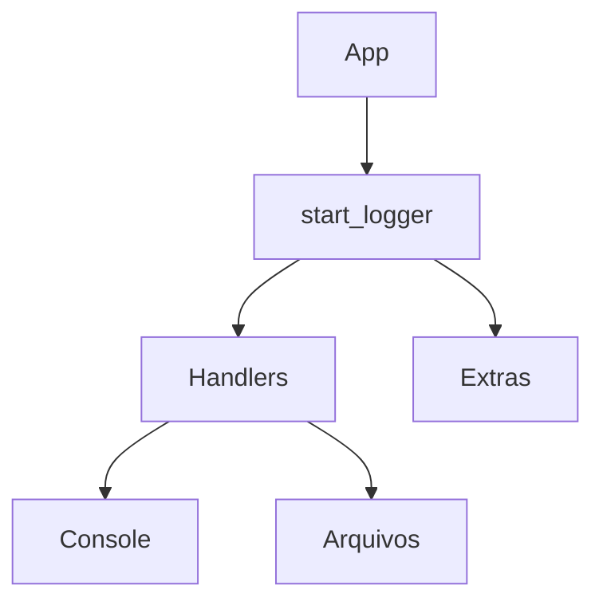
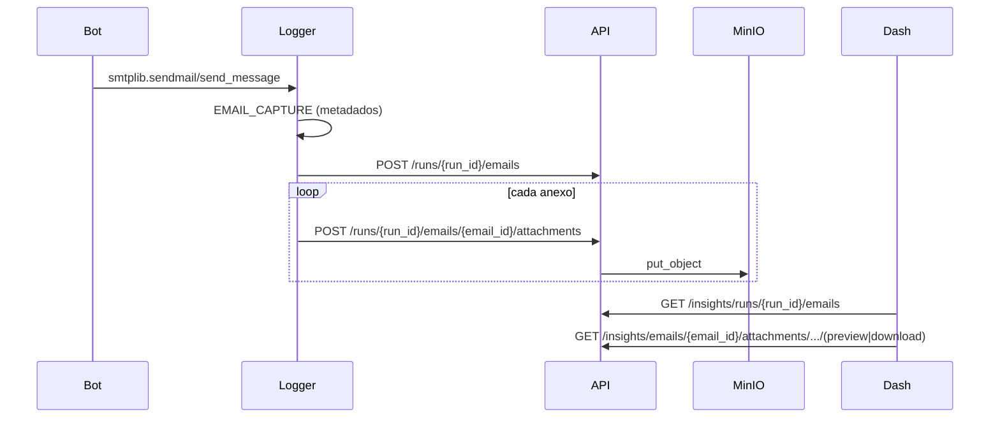
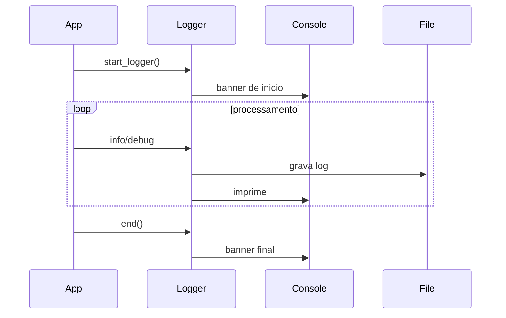

# Arquitetura
[Voltar ao indice](README.md)

## Componentes
- `logger/core/` - configuracao do logger, handlers e metadados.
- `logger/formatters/` - formatadores com cores e niveis customizados.
- `logger/handlers/` - handlers para console e arquivos.
- `logger/extras/` - utilitarios (timer, progress, lifecycle, metrics, captura de email).
- `remote_api/` - API FastAPI para ingest e consulta.
- `remote_dashboard/` - dashboard web (FastAPI + React SPA + proxy same-origin).
- `db/` - schema SQL usado pelos workers.

## Fluxo basico


## Fluxo remoto (opcional)
```mermaid
graph TD
    Bot --> API[Remote API]
    API --> MQ[RabbitMQ]
    MQ --> W[Workers]
    W --> PG[Postgres]
    API --> MINIO[MinIO anexos email]
    Dash[Dashboard] --> Proxy[/dashboard-api]
    Proxy --> API
```

## Fluxo de auditoria de email


## Sequencia tipica

